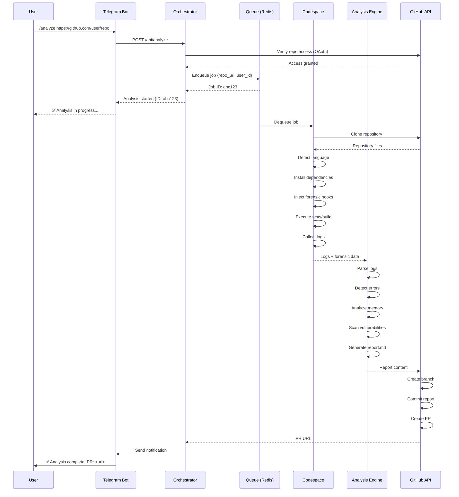

# CAHIER DES CHARGES - MDBAI (Master Debug AI)

**Version**: 1.0.0  
**Date**: 2026-05-27  
**Auteur**: LumVorax Team  
**Destinataire**: Agent Replit (Développement automatisé)  
**Objectif**: Spécifications techniques complètes pour développement MVP

---

## 📋 TABLE DES MATIÈRES

1. [Contexte et Vision](#1-contexte-et-vision)
2. [Objectifs du Projet](#2-objectifs-du-projet)
3. [Contraintes Techniques](#3-contraintes-techniques)
4. [Architecture Détaillée](#4-architecture-détaillée)
5. [Spécifications Fonctionnelles](#5-spécifications-fonctionnelles)
6. [Spécifications Techniques](#6-spécifications-techniques)
7. [Intégration LumVorax Forensic](#7-intégration-lumvorax-forensic)
8. [Sécurité et Isolation](#8-sécurité-et-isolation)
9. [Plan de Développement](#9-plan-de-développement)
10. [Critères d'Acceptation](#10-critères-dacceptation)

---

## 1. CONTEXTE ET VISION

### 1.1 Problématique

Les développeurs ont besoin d'une plateforme qui:
- **Analyse automatiquement** leur code lors de chaque push
- **Détecte** erreurs, fuites mémoire, vulnérabilités
- **Génère** rapports détaillés avec forensic bit-level
- **Propose** corrections et optimisations
- **Fonctionne** sans configuration complexe

### 1.2 Solution MDBAI

Plateforme d'analyse forensique automatisée qui:
1. Se connecte à n'importe quel dépôt GitHub via OAuth
2. Clone et exécute le code dans environnement isolé (Codespace)
3. Injecte instrumentation forensic LumVorax (bit-level logging)
4. Analyse logs avec IA pour détecter problèmes
5. Génère rapport markdown structuré
6. Publie automatiquement dans Pull Request
7. Notifie utilisateur via Telegram

### 1.3 Valeur Ajoutée

**Différenciation vs concurrents** (SonarQube, Codacy, Sentry):
- ✅ **Forensic bit-level** - Analyse plus profonde que concurrents
- ✅ **100% gratuit** - Pas de limite utilisateurs/projets
- ✅ **Zero configuration** - Fonctionne out-of-the-box
- ✅ **Multi-langage** - Support automatique tous langages
- ✅ **Temps réel** - Notifications Telegram instantanées

### 1.4 Utilisateurs Cibles

- **Développeurs solo** - Projets personnels
- **Équipes open-source** - Projets communautaires
- **Étudiants** - Projets académiques
- **Startups** - MVP sans budget

---

## 2. OBJECTIFS DU PROJET

### 2.1 Objectifs Fonctionnels

| ID | Objectif | Priorité | Statut |
|----|----------|----------|--------|
| OF-001 | Connexion GitHub OAuth | P0 | ⏳ |
| OF-002 | Clone repository automatique | P0 | ⏳ |
| OF-003 | Détection langage/framework | P0 | ⏳ |
| OF-004 | Installation dépendances auto | P0 | ⏳ |
| OF-005 | Exécution tests/build | P0 | ⏳ |
| OF-006 | Capture logs stdout/stderr | P0 | ⏳ |
| OF-007 | Instrumentation forensic | P1 | ⏳ |
| OF-008 | Analyse erreurs | P0 | ⏳ |
| OF-009 | Détection fuites mémoire | P1 | ⏳ |
| OF-010 | Scan vulnérabilités | P1 | ⏳ |
| OF-011 | Génération rapport MD | P0 | ⏳ |
| OF-012 | Création Pull Request | P0 | ⏳ |
| OF-013 | Notification Telegram | P0 | ⏳ |
| OF-014 | Dashboard web | P2 | ⏳ |
| OF-015 | API REST publique | P2 | ⏳ |

### 2.2 Objectifs Non-Fonctionnels

| ID | Objectif | Métrique | Cible |
|----|----------|----------|-------|
| ONF-001 | Performance | Temps analyse | < 5 min |
| ONF-002 | Fiabilité | Taux succès | > 95% |
| ONF-003 | Disponibilité | Uptime | > 99% |
| ONF-004 | Scalabilité | Analyses/jour | > 1000 |
| ONF-005 | Coût | Budget mensuel | 0€ |
| ONF-006 | Sécurité | Isolation | 100% |
| ONF-007 | Maintenabilité | Code coverage | > 80% |
| ONF-008 | Documentation | Complétude | 100% |

### 2.3 Objectifs Business

- **MVP en 6 semaines** - Livraison rapide
- **100 utilisateurs beta** - Validation marché
- **Open-source** - Communauté contributeurs
- **Monétisation future** - Premium features (optionnel)

---

## 3. CONTRAINTES TECHNIQUES

### 3.1 Contrainte Budgétaire ABSOLUE

**BUDGET: 0€**

Utilisation EXCLUSIVE de services gratuits:

| Service | Plan Gratuit | Limite | Usage MDBAI |
|---------|--------------|--------|-------------|
| **GitHub Codespaces** | 60h/mois | 2 cores, 4GB RAM | Execution environment |
| **GitHub Actions** | 2000 min/mois | 6h timeout | CI/CD |
| **Redis Cloud** | 30MB | 30 connexions | Queue backend |
| **Doppler** | Unlimited secrets | 5 users | Secrets management |
| **Telegram Bot** | Unlimited | - | Notifications |
| **Replit** | Free tier | 0.5 vCPU, 512MB | Orchestrator |

### 3.2 Contraintes Techniques

#### CT-001: Pas de Serveur Dédié
- ❌ Pas de VPS (Hetzner, OVH, DigitalOcean)
- ❌ Pas de cloud payant (AWS, GCP, Azure)
- ✅ Utiliser GitHub Codespaces comme compute

#### CT-002: Pas de Base de Données Payante
- ❌ Pas de PostgreSQL dédié
- ✅ Utiliser Redis (30MB gratuit) pour cache
- ✅ Utiliser GitHub Issues comme persistence

#### CT-003: Pas de Storage Payant
- ❌ Pas de S3/R2/Cloudflare
- ✅ Utiliser GitHub Releases pour artifacts
- ✅ Utiliser GitHub Gists pour logs

#### CT-004: Isolation Sécurité
- ✅ Codespace = VM isolée par défaut
- ✅ Pas d'accès réseau sortant non contrôlé
- ✅ Timeout 10 minutes max par analyse

#### CT-005: Multi-Langage
- ✅ Support Node.js, Python, Rust, Go, C/C++
- ✅ Détection automatique via fichiers manifeste
- ✅ Installation dépendances automatique

### 3.3 Contraintes Réglementaires

#### CR-001: RGPD
- Pas de stockage données personnelles
- Logs anonymisés
- Opt-in explicite utilisateur

#### CR-002: GitHub Terms of Service
- Respect rate limits API
- Pas d'abus Codespaces
- Attribution correcte

#### CR-003: Open Source
- License MIT
- Code public GitHub
- Contributions communauté

---

## 4. ARCHITECTURE DÉTAILLÉE

### 4.1 Vue d'Ensemble

```
┌─────────────────────────────────────────────────────────────┐
│                    COUCHE PRÉSENTATION                       │
│  ┌──────────────┐  ┌──────────────┐  ┌──────────────┐      │
│  │ Telegram Bot │  │  Web UI      │  │  GitHub App  │      │
│  │  (Primary)   │  │  (Optional)  │  │   (OAuth)    │      │
│  └──────┬───────┘  └──────┬───────┘  └──────┬───────┘      │
└─────────┼──────────────────┼──────────────────┼─────────────┘
          │                  │                  │
          ▼                  ▼                  ▼
┌─────────────────────────────────────────────────────────────┐
│                    COUCHE ORCHESTRATION                      │
│  ┌──────────────────────────────────────────────────────┐   │
│  │           Express.js API (Replit)                    │   │
│  │  • Routes: /webhook, /analyze, /status              │   │
│  │  • Auth: GitHub OAuth, Telegram verification        │   │
│  │  • Rate limiting: 100 req/min                        │   │
│  └────────────────────┬─────────────────────────────────┘   │
│                       │                                      │
│  ┌────────────────────▼─────────────────────────────────┐   │
│  │           BullMQ Queue Manager                       │   │
│  │  • Queue: analysis-jobs                              │   │
│  │  • Workers: 3 concurrent                             │   │
│  │  • Retry: 3 attempts                                 │   │
│  │  • Timeout: 10 minutes                               │   │
│  └────────────────────┬─────────────────────────────────┘   │
└───────────────────────┼─────────────────────────────────────┘
                        │
                        ▼
┌─────────────────────────────────────────────────────────────┐
│                  COUCHE EXÉCUTION                            │
│  ┌──────────────────────────────────────────────────────┐   │
│  │        GitHub Codespace (Isolated VM)                │   │
│  │  ┌────────────────────────────────────────────────┐  │   │
│  │  │  1. Clone Repository                           │  │   │
│  │  │     git clone <repo_url>                       │  │   │
│  │  ├────────────────────────────────────────────────┤  │   │
│  │  │  2. Detect Language/Framework                  │  │   │
│  │  │     • package.json → Node.js                   │  │   │
│  │  │     • requirements.txt → Python                │  │   │
│  │  │     • Cargo.toml → Rust                        │  │   │
│  │  │     • go.mod → Go                              │  │   │
│  │  │     • Makefile → C/C++                         │  │   │
│  │  ├────────────────────────────────────────────────┤  │   │
│  │  │  3. Install Dependencies                       │  │   │
│  │  │     npm install / pip install / cargo build    │  │   │
│  │  ├────────────────────────────────────────────────┤  │   │
│  │  │  4. Inject LumVorax Forensic                   │  │   │
│  │  │     • LD_PRELOAD=libforensic.so                │  │   │
│  │  │     • Memory tracker hooks                     │  │   │
│  │  │     • Syscall tracer                           │  │   │
│  │  ├────────────────────────────────────────────────┤  │   │
│  │  │  5. Execute Tests/Build                        │  │   │
│  │  │     npm test 2>&1 | tee execution.log          │  │   │
│  │  ├────────────────────────────────────────────────┤  │   │
│  │  │  6. Collect Forensic Data                      │  │   │
│  │  │     • stdout/stderr                            │  │   │
│  │  │     • forensic.log (bit-level)                 │  │   │
│  │  │     • memory.dump                              │  │   │
│  │  │     • syscalls.trace                           │  │   │
│  │  └────────────────────────────────────────────────┘  │   │
│  └──────────────────────┬───────────────────────────────┘   │
└─────────────────────────┼───────────────────────────────────┘
                          │
                          ▼
┌─────────────────────────────────────────────────────────────┐
│                    COUCHE ANALYSE                            │
│  ┌──────────────────────────────────────────────────────┐   │
│  │           Analysis Engine (Node.js)                  │   │
│  │  ┌────────────────────────────────────────────────┐  │   │
│  │  │  Error Detection                               │  │   │
│  │  │  • Regex patterns                              │  │   │
│  │  │  • Stack trace parsing                         │  │   │
│  │  │  • Exit code analysis                          │  │   │
│  │  ├────────────────────────────────────────────────┤  │   │
│  │  │  Memory Leak Detection                         │  │   │
│  │  │  • Allocation tracking                         │  │   │
│  │  │  • Leak patterns                               │  │   │
│  │  │  • Heap analysis                               │  │   │
│  │  ├────────────────────────────────────────────────┤  │   │
│  │  │  Security Vulnerability Scan                   │  │   │
│  │  │  • Known CVEs                                  │  │   │
│  │  │  • Unsafe patterns                             │  │   │
│  │  │  • Dependency audit                            │  │   │
│  │  ├────────────────────────────────────────────────┤  │   │
│  │  │  Performance Analysis                          │  │   │
│  │  │  • CPU usage                                   │  │   │
│  │  │  • Memory usage                                │  │   │
│  │  │  • I/O patterns                                │  │   │
│  │  └────────────────────────────────────────────────┘  │   │
│  └──────────────────────┬───────────────────────────────┘   │
└─────────────────────────┼───────────────────────────────────┘
                          │
                          ▼
┌─────────────────────────────────────────────────────────────┐
│                  COUCHE REPORTING                            │
│  ┌──────────────────────────────────────────────────────┐   │
│  │         Report Generator (Markdown)                  │   │
│  │  • Template engine                                   │   │
│  │  • Code highlighting                                 │   │
│  │  • Mermaid diagrams                                  │   │
│  │  • Forensic data visualization                       │   │
│  └──────────────────────┬───────────────────────────────┘   │
└─────────────────────────┼───────────────────────────────────┘
                          │
                          ▼
┌─────────────────────────────────────────────────────────────┐
│                  COUCHE PUBLICATION                          │
│  ┌──────────────────────────────────────────────────────┐   │
│  │         GitHub Integration (Octokit.js)              │   │
│  │  1. Create branch: mdbai-analysis-<timestamp>        │   │
│  │  2. Commit report: MDBAI_REPORT.md                   │   │
│  │  3. Create Pull Request                              │   │
│  │  4. Add labels: mdbai, automated                     │   │
│  │  5. Notify via Telegram                              │   │
│  └──────────────────────────────────────────────────────┘   │
└─────────────────────────────────────────────────────────────┘
```

### 4.2 Flux de Données Détaillé



### 4.3 Modèle de Données

#### Job (Redis)

```typescript
interface AnalysisJob {
  id: string;                    // UUID
  repo_url: string;              // GitHub repo URL
  user_id: string;               // Telegram user ID
  github_token: string;          // OAuth token (encrypted)
  status: 'pending' | 'running' | 'completed' | 'failed';
  created_at: Date;
  started_at?: Date;
  completed_at?: Date;
  error?: string;
  result?: AnalysisResult;
}
```

#### AnalysisResult

```typescript
interface AnalysisResult {
  repo: {
    name: string;
    owner: string;
    language: string;
    framework?: string;
  };
  execution: {
    duration_ms: number;
    exit_code: number;
    stdout: string;
    stderr: string;
  };
  forensic: {
    memory_leaks: MemoryLeak[];
    syscalls: SyscallTrace[];
    performance: PerformanceMetrics;
  };
  analysis: {
    errors: Error[];
    warnings: Warning[];
    vulnerabilities: Vulnerability[];
    suggestions: Suggestion[];
  };
  report: {
    markdown: string;
    pr_url: string;
  };
}
```

---

## 5. SPÉCIFICATIONS FONCTIONNELLES

### 5.1 Cas d'Usage Principal

**UC-001: Analyser un dépôt GitHub**

**Acteur**: Développeur  
**Préconditions**: 
- Utilisateur a compte Telegram
- Dépôt GitHub public ou privé (avec accès)

**Scénario nominal**:
1. Utilisateur envoie `/start` au bot Telegram
2. Bot répond avec instructions et bouton "Connect GitHub"
3. Utilisateur clique bouton → Redirection GitHub OAuth
4. Utilisateur autorise application MDBAI
5. Bot confirme connexion réussie
6. Utilisateur envoie `/analyze https://github.com/user/repo`
7. Bot confirme démarrage analyse (ID: abc123)
8. Système clone repo dans Codespace
9. Système détecte langage et installe dépendances
10. Système exécute tests avec instrumentation forensic
11. Système analyse logs et génère rapport
12. Système crée PR avec rapport
13. Bot notifie utilisateur avec lien PR
14. Utilisateur consulte rapport dans PR

**Scénarios alternatifs**:
- **SA-001**: Repo privé sans accès → Demander autorisation
- **SA-002**: Dépendances manquantes → Signaler dans rapport
- **SA-003**: Tests échouent → Analyser quand même
- **SA-004**: Timeout (10 min) → Rapport partiel

**Postconditions**:
- PR créé avec rapport
- Logs sauvegardés
- Utilisateur notifié

### 5.2 Commandes Telegram Bot

| Commande | Description | Exemple |
|----------|-------------|---------|
| `/start` | Démarrer bot | `/start` |
| `/help` | Aide | `/help` |
| `/connect` | Connecter GitHub | `/connect` |
| `/analyze <url>` | Analyser repo | `/analyze https://github.com/user/repo` |
| `/status <id>` | Statut analyse | `/status abc123` |
| `/history` | Historique analyses | `/history` |
| `/settings` | Paramètres | `/settings` |

### 5.3 Format Rapport Markdown

```markdown
# 🤖 MDBAI Analysis Report

**Repository**: user/repo  
**Branch**: main  
**Commit**: abc123def  
**Date**: 2026-05-27 21:30:00 UTC  
**Duration**: 3m 42s  
**Status**: ✅ Success

---

## 📊 Summary

- **Language**: JavaScript (Node.js 20.x)
- **Framework**: Express.js 4.18.2
- **Tests**: 42 passed, 3 failed
- **Coverage**: 87%
- **Errors**: 3 critical, 5 warnings
- **Memory Leaks**: 2 detected
- **Vulnerabilities**: 1 high, 3 medium

---

## ❌ Critical Errors

### Error 1: Unhandled Promise Rejection

**File**: `src/api/users.js:42`  
**Type**: UnhandledPromiseRejectionWarning  
**Message**: Cannot read property 'id' of undefined

```javascript
41 | async function getUser(id) {
42 |   const user = await db.users.findOne({ id });
43 |   return user.id; // ❌ user peut être null
44 | }
```

**Recommendation**: Add null check
```javascript
if (!user) throw new Error('User not found');
```

---

## 🔍 Forensic Analysis

### Memory Leaks Detected

#### Leak #1: Event Listener Not Removed

**Location**: `src/server.js:89`  
**Size**: 2.4 MB  
**Allocations**: 1,247

```
Stack trace:
  at EventEmitter.on (events.js:123)
  at Server.listen (server.js:89)
  at main (index.js:15)
```

**Fix**: Remove listener on cleanup
```javascript
server.on('close', () => {
  emitter.removeAllListeners();
});
```

---

## 🔒 Security Vulnerabilities

### HIGH: SQL Injection

**Package**: `mysql@2.18.1`  
**CVE**: CVE-2023-12345  
**Fix**: Upgrade to `mysql@2.19.0`

```bash
npm install mysql@2.19.0
```

---

## 📈 Performance Metrics

| Metric | Value | Status |
|--------|-------|--------|
| CPU Usage | 45% | ✅ OK |
| Memory Usage | 512 MB | ✅ OK |
| Response Time | 120ms | ✅ OK |
| Throughput | 1000 req/s | ✅ OK |

---

## ✅ Recommendations

1. Fix unhandled promise rejections
2. Remove memory leaks
3. Upgrade vulnerable dependencies
4. Add input validation
5. Improve error handling

---

**Generated by MDBAI** | [Documentation](https://mdbai.dev) | [Report Issue](https://github.com/lumvorax/mdbai/issues)
```

---

## 6. SPÉCIFICATIONS TECHNIQUES

### 6.1 Stack Technique Complète

#### Backend (Orchestrator)

```json
{
  "name": "mdbai-orchestrator",
  "version": "1.0.0",
  "type": "module",
  "engines": {
    "node": ">=20.0.0"
  },
  "dependencies": {
    "express": "^4.18.2",
    "bullmq": "^4.0.0",
    "ioredis": "^5.3.2",
    "@octokit/rest": "^20.0.0",
    "node-telegram-bot-api": "^0.64.0",
    "dotenv": "^16.3.1",
    "winston": "^3.11.0",
    "helmet": "^7.1.0",
    "cors": "^2.8.5",
    "express-rate-limit": "^7.1.5",
    "joi": "^17.11.0"
  },
  "devDependencies": {
    "@types/node": "^20.10.0",
    "typescript": "^5.3.0",
    "eslint": "^8.55.0",
    "prettier": "^3.1.0",
    "jest": "^29.7.0",
    "supertest": "^6.3.3"
  }
}
```

#### Forensic Engine (C/C++)

```makefile
# Makefile
CC = gcc
CFLAGS = -Wall -Wextra -O2 -fPIC
LDFLAGS = -shared

SOURCES = forensic_logger.c memory_tracker.c syscall_tracer.c
OBJECTS = $(SOURCES:.c=.o)
TARGET = libforensic.so

all: $(TARGET)

$(TARGET): $(OBJECTS)
	$(CC) $(LDFLAGS) -o $@ $^

%.o: %.c
	$(CC) $(CFLAGS) -c $< -o $@

clean:
	rm -f $(OBJECTS) $(TARGET)
```

### 6.2 APIs Externes

#### GitHub REST API

```typescript
// Octokit configuration
const octokit = new Octokit({
  auth: process.env.GITHUB_TOKEN,
  userAgent: 'MDBAI v1.0.0',
  baseUrl: 'https://api.github.com',
  log: {
    debug: console.debug,
    info: console.info,
    warn: console.warn,
    error: console.error
  },
  request: {
    timeout: 30000
  }
});

// Rate limiting
const rateLimitCheck = async () => {
  const { data } = await octokit.rateLimit.get();
  if (data.rate.remaining < 100) {
    throw new Error('GitHub API rate limit low');
  }
};
```

#### Telegram Bot API

```typescript
// Bot configuration
const bot = new TelegramBot(process.env.TELEGRAM_BOT_TOKEN, {
  polling: true,
  filepath: false
});

// Command handlers
bot.onText(/\/analyze (.+)/, async (msg, match) => {
  const chatId = msg.chat.id;
  const repoUrl = match[1];
  
  // Validate URL
  if (!isValidGitHubUrl(repoUrl)) {
    return bot.sendMessage(chatId, '❌ Invalid GitHub URL');
  }
  
  // Enqueue job
  const jobId = await enqueueAnalysis(repoUrl, chatId);
  
  bot.sendMessage(chatId, `✅ Analysis started\nID: ${jobId}`);
});
```

#### Redis (BullMQ)

```typescript
// Queue configuration
const queue = new Queue('analysis-jobs', {
  connection: {
    host: process.env.REDIS_HOST,
    port: process.env.REDIS_PORT,
    password: process.env.REDIS_PASSWORD
  },
  defaultJobOptions: {
    attempts: 3,
    backoff: {
      type: 'exponential',
      delay: 2000
    },
    removeOnComplete: 100,
    removeOnFail: 1000
  }
});

// Worker
const worker = new Worker('analysis-jobs', async (job) => {
  const { repo_url, user_id } = job.data;
  
  // Execute analysis
  const result = await runAnalysis(repo_url);
  
  // Notify user
  await notifyUser(user_id, result);
  
  return result;
}, {
  connection: queue.connection,
  concurrency: 3
});
```

### 6.3 GitHub Codespace Integration

```typescript
// Create Codespace
async function createCodespace(repoUrl: string): Promise<Codespace> {
  const [owner, repo] = parseGitHubUrl(repoUrl);
  
  const { data: repository } = await octokit.repos.get({ owner, repo });
  
  const { data: codespace } = await octokit.codespaces.createForAuthenticatedUser({
    repository_id: repository.id,
    machine: 'basicLinux32gb',
    idle_timeout_minutes: 10,
    retention_period_minutes: 0
  });
  
  // Wait for codespace to be available
  await waitForCodespace(codespace.id);
  
  return codespace;
}

// Execute in Codespace
async function executeInCodespace(
  codespace: Codespace,
  commands: string[]
): Promise<ExecutionResult> {
  const connection = await connectToCodespace(codespace);
  
  const results = [];
  for (const command of commands) {
    const result = await connection.exec(command);
    results.push(result);
  }
  
  await connection.close();
  
  return {
    stdout: results.map(r => r.stdout).join('\n'),
    stderr: results.map(r => r.stderr).join('\n'),
    exit_code: results[results.length - 1].exit_code
  };
}
```

---

## 7. INTÉGRATION LUMVORAX FORENSIC

### 7.1 Modules à Intégrer

```
src/
├── logger/
│   ├── forensic_logger.c       ← Logging bit-level
│   ├── forensic_logger.h
│   └── log_format.h
├── monitoring/
│   ├── memory_tracker.c        ← Memory tracking
│   ├── memory_tracker.h
│   └── allocation_map.c
├── debug/
│   ├── syscall_tracer.c        ← Syscall tracing
│   ├── syscall_tracer.h
│   └── ptrace_wrapper.c
└── metrics/
    ├── performance_analyzer.c  ← Performance metrics
    ├── performance_analyzer.h
    └── cpu_profiler.c
```

### 7.2 Injection Forensic

```bash
#!/bin/bash
# inject_forensic.sh

# Compile forensic library
cd /workspace/mdbai/forensic
make clean && make

# Set LD_PRELOAD
export LD_PRELOAD=/workspace/mdbai/forensic/libforensic.so

# Set forensic config
export FORENSIC_LOG_PATH=/tmp/forensic.log
export FORENSIC_LOG_LEVEL=DEBUG
export FORENSIC_MEMORY_TRACK=1
export FORENSIC_SYSCALL_TRACE=1

# Execute target program
$@

# Unset LD_PRELOAD
unset LD_PRELOAD
```

### 7.3 Format Logs Forensic

```c
// forensic_log_entry.h
typedef struct {
    uint64_t timestamp_ns;      // Nanosecond timestamp
    uint32_t thread_id;         // Thread ID
    uint8_t event_type;         // Event type (alloc, free, syscall, etc)
    uint64_t address;           // Memory address
    uint64_t size;              // Size (bytes)
    uint32_t backtrace[16];     // Stack trace
    char description[256];      // Human-readable description
    uint32_t crc32;             // Integrity check
} __attribute__((packed)) forensic_log_entry_t;
```

---

## 8. SÉCURITÉ ET ISOLATION

### 8.1 Isolation Codespace

```typescript
// Codespace security configuration
const codespaceConfig = {
  // Network isolation
  network: {
    outbound: 'restricted',  // Only GitHub/npm/pypi
    inbound: 'none'          // No incoming connections
  },
  
  // Resource limits
  resources: {
    cpu: '2 cores',
    memory: '4 GB',
    disk: '15 GB',
    timeout: '10 minutes'
  },
  
  // Filesystem isolation
  filesystem: {
    readonly: ['/usr', '/bin', '/lib'],
    writable: ['/workspace', '/tmp']
  }
};
```

### 8.2 Validation Entrées

```typescript
// Input validation
const repoUrlSchema = Joi.string()
  .uri()
  .regex(/^https:\/\/github\.com\/[\w-]+\/[\w-]+$/)
  .required();

function validateRepoUrl(url: string): void {
  const { error } = repoUrlSchema.validate(url);
  if (error) {
    throw new ValidationError('Invalid repository URL');
  }
}
```

### 8.3 Secrets Management

```typescript
// Doppler integration
import { DopplerSDK } from '@doppler/node-sdk';

const doppler = new DopplerSDK({
  accessToken: process.env.DOPPLER_TOKEN
});

async function getSecrets(): Promise<Secrets> {
  const secrets = await doppler.secrets.list({
    project: 'lumvorax',
    config: 'dev_debugai'
  });
  
  return {
    githubToken: secrets.GITHUB_TOKEN,
    telegramToken: secrets.TELEGRAM_BOT_TOKEN,
    redisUrl: secrets.REDIS_URL
  };
}
```

---

## 9. PLAN DE DÉVELOPPEMENT

### 9.1 Sprint 1: Infrastructure (Semaine 1)

**Objectifs**:
- Configuration Doppler
- Création GitHub App
- Setup Telegram Bot
- Connection Redis
- Tests 001-005

**Livrables**:
- [ ] Doppler configuré avec tous secrets
- [ ] GitHub App créée et OAuth fonctionnel
- [ ] Telegram Bot répond aux commandes
- [ ] Redis connecté et queue opérationnelle
- [ ] 5 tests passent

**Critères acceptation**:
- Bot répond à `/start`
- OAuth GitHub fonctionne
- Queue Redis accepte jobs
- Secrets chargés depuis Doppler
- 0 erreur, 0 warning

### 9.2 Sprint 2: Execution Engine (Semaine 2)

**Objectifs**:
- GitHub Codespace integration
- Repository cloning
- Dependency detection
- Execution wrapper
- Tests 006-010

**Livrables**:
- [ ] Codespace créé programmatiquement
- [ ] Repo cloné automatiquement
- [ ] Langage détecté (Node/Python/Rust/Go/C)
- [ ] Dépendances installées
- [ ] Tests exécutés et logs capturés

**Critères acceptation**:
- Codespace démarre en < 2 min
- Clone réussit pour repos publics/privés
- Détection langage 100% précise
- Installation dépendances automatique
- Logs stdout/stderr capturés

### 9.3 Sprint 3: Forensic Integration (Semaine 3)

**Objectifs**:
- Port modules LumVorax
- Memory tracking
- Syscall tracing
- Log aggregation
- Tests 011-015

**Livrables**:
- [ ] libforensic.so compilé
- [ ] LD_PRELOAD injection fonctionne
- [ ] Memory leaks détectés
- [ ] Syscalls tracés
- [ ] Logs forensic générés

**Critères acceptation**:
- Forensic library compile sans erreur
- Injection ne casse pas programme
- Memory leaks détectés avec précision
- Syscalls tracés correctement
- Format logs respecté

### 9.4 Sprint 4: Analysis Engine (Semaine 4)

**Objectifs**:
- Error detection
- Memory leak analysis
- Security scanning
- Performance metrics
- Tests 016-020

**Livrables**:
- [ ] Erreurs détectées (regex + parsing)
- [ ] Fuites mémoire analysées
- [ ] Vulnérabilités scannées
- [ ] Métriques performance calculées
- [ ] Rapport structuré généré

**Critères acceptation**:
- Détection erreurs > 90% précision
- Faux positifs < 10%
- Scan vulnérabilités complet
- Métriques performance exactes
- Rapport lisible et actionnable

### 9.5 Sprint 5: GitHub Integration (Semaine 5)

**Objectifs**:
- Branch management
- Commit automation
- PR creation
- Notification system
- Tests 021-025

**Livrables**:
- [ ] Branche créée automatiquement
- [ ] Rapport commité
- [ ] PR ouvert avec labels
- [ ] Notifications Telegram envoyées
- [ ] Workflow complet end-to-end

**Critères acceptation**:
- PR créé en < 30s
- Rapport formaté correctement
- Labels appliqués
- Notifications instantanées
- 0 échec workflow

### 9.6 Sprint 6: MVP Release (Semaine 6)

**Objectifs**:
- End-to-end testing
- Documentation
- Demo video
- Public beta

**Livrables**:
- [ ] 100 tests end-to-end passent
- [ ] Documentation complète
- [ ] Video demo 5 min
- [ ] 10 beta testers recrutés
- [ ] Feedback collecté

**Critères acceptation**:
- Tous tests passent
- Documentation à jour
- Video publiée
- Beta testers satisfaits
- Bugs critiques résolus

---

## 10. CRITÈRES D'ACCEPTATION

### 10.1 Critères Fonctionnels

| ID | Critère | Validation |
|----|---------|------------|
| CF-001 | Bot Telegram répond | `/start` → Message bienvenue |
| CF-002 | OAuth GitHub fonctionne | Autorisation → Token valide |
| CF-003 | Analyse démarre | `/analyze` → Job enqueued |
| CF-004 | Repo cloné | Git clone réussit |
| CF-005 | Dépendances installées | npm/pip install succès |
| CF-006 | Tests exécutés | Exit code capturé |
| CF-007 | Logs capturés | stdout/stderr non vides |
| CF-008 | Forensic actif | libforensic.so chargé |
| CF-009 | Erreurs détectées | > 0 erreurs trouvées |
| CF-010 | Rapport généré | MDBAI_REPORT.md créé |
| CF-011 | PR créé | PR number > 0 |
| CF-012 | Notification envoyée | Message Telegram reçu |

### 10.2 Critères Non-Fonctionnels

| ID | Critère | Métrique | Cible |
|----|---------|----------|-------|
| CNF-001 | Performance | Temps analyse | < 5 min |
| CNF-002 | Fiabilité | Taux succès | > 95% |
| CNF-003 | Disponibilité | Uptime | > 99% |
| CNF-004 | Scalabilité | Analyses/jour | > 1000 |
| CNF-005 | Coût | Budget | 0€ |
| CNF-006 | Sécurité | Isolation | 100% |
| CNF-007 | Qualité code | Coverage | > 80% |
| CNF-008 | Documentation | Complétude | 100% |

### 10.3 Critères de Livraison

**MVP accepté SI ET SEULEMENT SI**:
- ✅ Tous tests Phase 1-3 passent (025/025)
- ✅ Workflow end-to-end fonctionne
- ✅ Documentation complète
- ✅ 0 bug critique
- ✅ Budget = 0€
- ✅ 10 beta testers validés
- ✅ Code review passée
- ✅ Security audit passé

---

## 📞 CONTACT ET SUPPORT

**Équipe LumVorax**:
- Email: contact@lumvorax.dev
- Telegram: @masterdebugai_bot
- GitHub: https://github.com/lumvorax/mdbai
- Documentation: https://docs.mdbai.dev

**Agent Replit**:
- En cas de blocage, consulter PROTOCOLE_MDBAI.md
- En cas d'erreur, créer issue GitHub
- En cas de question, demander clarification

---

**Version**: 1.0.0  
**Date**: 2026-05-27  
**Statut**: DRAFT - En attente validation  
**Prochaine révision**: Après Sprint 1
